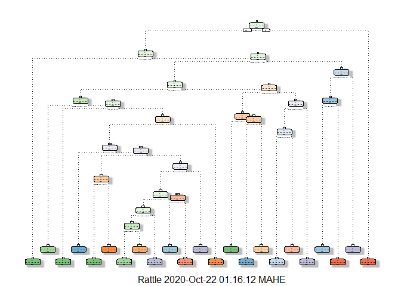
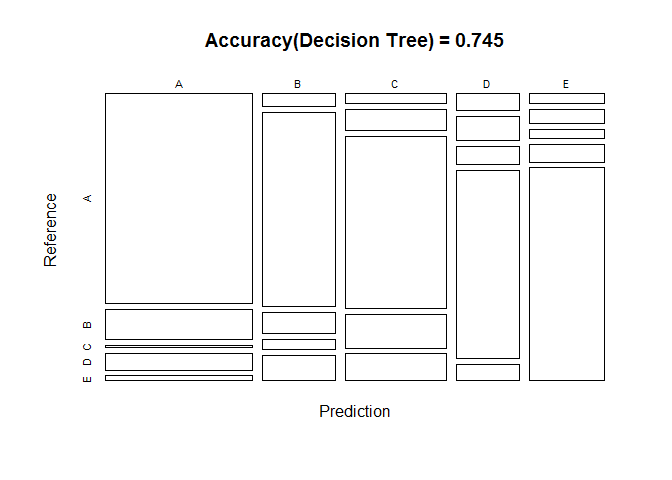
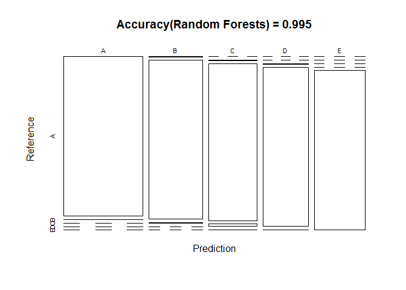

### 1.A Brief Overview

Using devices such as Jawbone Up, Nike FuelBand, and Fitbit it is now
possible to collect a large amount of data about personal activity
relatively inexpensively. One thing that people regularly do is quantify
how much of a particular activity they do, but they rarely quantify how
well they do it.  
In this project, we will use data from accelerometers on the belt,
forearm, arm, and dumbell of 6 participants. They were asked to perform
barbell lifts correctly and incorrectly in 5 different ways.  
The goal of this project is to predict the manner in which they did the
exercise.

### 2.Loading the Data

``` r
suppressPackageStartupMessages(library(rpart))
suppressPackageStartupMessages(library(rpart.plot))
suppressPackageStartupMessages(library(caret))
suppressPackageStartupMessages(library(rattle))
suppressPackageStartupMessages(library(randomForest))
```

``` r
training_data<-read.csv(url("https://d396qusza40orc.cloudfront.net/predmachlearn/pml-training.csv"),header=TRUE,na.strings = "")
testing_data<-read.csv(url("https://d396qusza40orc.cloudfront.net/predmachlearn/pml-testing.csv"),header=TRUE,na.strings = "")
```

### 3.Processing Data

We will split the training data into 2 parts i.e 75% training data and
25% test data.

``` r
partition<- createDataPartition(training_data$classe, p=0.75, list=FALSE)
training_new <- training_data[partition,]
testing_new <- training_data[-partition,]
```

``` r
dim(training_new)
```

    ## [1] 14718   160

``` r
dim(testing_new)
```

    ## [1] 4904  160

Both the training and testing data has 160 columns.

``` r
str(training_data,list.len=50)
```

    ## 'data.frame':    19622 obs. of  160 variables:
    ##  $ X                       : int  1 2 3 4 5 6 7 8 9 10 ...
    ##  $ user_name               : Factor w/ 6 levels "adelmo","carlitos",..: 2 2 2 2 2 2 2 2 2 2 ...
    ##  $ raw_timestamp_part_1    : int  1323084231 1323084231 1323084231 1323084232 1323084232 1323084232 1323084232 1323084232 1323084232 1323084232 ...
    ##  $ raw_timestamp_part_2    : int  788290 808298 820366 120339 196328 304277 368296 440390 484323 484434 ...
    ##  $ cvtd_timestamp          : Factor w/ 20 levels "02/12/2011 13:32",..: 9 9 9 9 9 9 9 9 9 9 ...
    ##  $ new_window              : Factor w/ 2 levels "no","yes": 1 1 1 1 1 1 1 1 1 1 ...
    ##  $ num_window              : int  11 11 11 12 12 12 12 12 12 12 ...
    ##  $ roll_belt               : num  1.41 1.41 1.42 1.48 1.48 1.45 1.42 1.42 1.43 1.45 ...
    ##  $ pitch_belt              : num  8.07 8.07 8.07 8.05 8.07 8.06 8.09 8.13 8.16 8.17 ...
    ##  $ yaw_belt                : num  -94.4 -94.4 -94.4 -94.4 -94.4 -94.4 -94.4 -94.4 -94.4 -94.4 ...
    ##  $ total_accel_belt        : int  3 3 3 3 3 3 3 3 3 3 ...
    ##  $ kurtosis_roll_belt      : Factor w/ 396 levels "-0.016850","-0.021024",..: NA NA NA NA NA NA NA NA NA NA ...
    ##  $ kurtosis_picth_belt     : Factor w/ 316 levels "-0.021887","-0.060755",..: NA NA NA NA NA NA NA NA NA NA ...
    ##  $ kurtosis_yaw_belt       : Factor w/ 1 level "#DIV/0!": NA NA NA NA NA NA NA NA NA NA ...
    ##  $ skewness_roll_belt      : Factor w/ 394 levels "-0.003095","-0.010002",..: NA NA NA NA NA NA NA NA NA NA ...
    ##  $ skewness_roll_belt.1    : Factor w/ 337 levels "-0.005928","-0.005960",..: NA NA NA NA NA NA NA NA NA NA ...
    ##  $ skewness_yaw_belt       : Factor w/ 1 level "#DIV/0!": NA NA NA NA NA NA NA NA NA NA ...
    ##  $ max_roll_belt           : Factor w/ 196 levels "-0.2","-0.4",..: 196 196 196 196 196 196 196 196 196 196 ...
    ##  $ max_picth_belt          : Factor w/ 23 levels "10","11","17",..: 23 23 23 23 23 23 23 23 23 23 ...
    ##  $ max_yaw_belt            : Factor w/ 67 levels "-0.1","-0.2",..: NA NA NA NA NA NA NA NA NA NA ...
    ##  $ min_roll_belt           : Factor w/ 185 levels "-0.2","-0.5",..: 185 185 185 185 185 185 185 185 185 185 ...
    ##  $ min_pitch_belt          : Factor w/ 17 levels "0","1","15","16",..: 17 17 17 17 17 17 17 17 17 17 ...
    ##  $ min_yaw_belt            : Factor w/ 67 levels "-0.1","-0.2",..: NA NA NA NA NA NA NA NA NA NA ...
    ##  $ amplitude_roll_belt     : Factor w/ 149 levels "0","0.1","0.13",..: 149 149 149 149 149 149 149 149 149 149 ...
    ##  $ amplitude_pitch_belt    : Factor w/ 14 levels "0","1","10","11",..: 14 14 14 14 14 14 14 14 14 14 ...
    ##  $ amplitude_yaw_belt      : Factor w/ 3 levels "#DIV/0!","0.00",..: NA NA NA NA NA NA NA NA NA NA ...
    ##  $ var_total_accel_belt    : Factor w/ 66 levels "0","0.0217","0.0278",..: 66 66 66 66 66 66 66 66 66 66 ...
    ##  $ avg_roll_belt           : Factor w/ 192 levels "-0.2","-0.3",..: 192 192 192 192 192 192 192 192 192 192 ...
    ##  $ stddev_roll_belt        : Factor w/ 70 levels "0","0.091","0.0957",..: 70 70 70 70 70 70 70 70 70 70 ...
    ##  $ var_roll_belt           : Factor w/ 97 levels "0","0.0083","0.0092",..: 97 97 97 97 97 97 97 97 97 97 ...
    ##  $ avg_pitch_belt          : Factor w/ 215 levels "-0.2","-0.4",..: 215 215 215 215 215 215 215 215 215 215 ...
    ##  $ stddev_pitch_belt       : Factor w/ 44 levels "0","0.0571","0.1",..: 44 44 44 44 44 44 44 44 44 44 ...
    ##  $ var_pitch_belt          : Factor w/ 64 levels "0","0.0033","0.0393",..: 64 64 64 64 64 64 64 64 64 64 ...
    ##  $ avg_yaw_belt            : Factor w/ 241 levels "-0.1","-0.7",..: 241 241 241 241 241 241 241 241 241 241 ...
    ##  $ stddev_yaw_belt         : Factor w/ 59 levels "0","0.0407","0.0522",..: 59 59 59 59 59 59 59 59 59 59 ...
    ##  $ var_yaw_belt            : Factor w/ 146 levels "0","0.0017","0.0027",..: 146 146 146 146 146 146 146 146 146 146 ...
    ##  $ gyros_belt_x            : num  0 0.02 0 0.02 0.02 0.02 0.02 0.02 0.02 0.03 ...
    ##  $ gyros_belt_y            : num  0 0 0 0 0.02 0 0 0 0 0 ...
    ##  $ gyros_belt_z            : num  -0.02 -0.02 -0.02 -0.03 -0.02 -0.02 -0.02 -0.02 -0.02 0 ...
    ##  $ accel_belt_x            : int  -21 -22 -20 -22 -21 -21 -22 -22 -20 -21 ...
    ##  $ accel_belt_y            : int  4 4 5 3 2 4 3 4 2 4 ...
    ##  $ accel_belt_z            : int  22 22 23 21 24 21 21 21 24 22 ...
    ##  $ magnet_belt_x           : int  -3 -7 -2 -6 -6 0 -4 -2 1 -3 ...
    ##  $ magnet_belt_y           : int  599 608 600 604 600 603 599 603 602 609 ...
    ##  $ magnet_belt_z           : int  -313 -311 -305 -310 -302 -312 -311 -313 -312 -308 ...
    ##  $ roll_arm                : num  -128 -128 -128 -128 -128 -128 -128 -128 -128 -128 ...
    ##  $ pitch_arm               : num  22.5 22.5 22.5 22.1 22.1 22 21.9 21.8 21.7 21.6 ...
    ##  $ yaw_arm                 : num  -161 -161 -161 -161 -161 -161 -161 -161 -161 -161 ...
    ##  $ total_accel_arm         : int  34 34 34 34 34 34 34 34 34 34 ...
    ##  $ var_accel_arm           : Factor w/ 396 levels "0","0.0179","0.02",..: 396 396 396 396 396 396 396 396 396 396 ...
    ##   [list output truncated]

The first seven variables are basically timestamps and ids which will
just create noise in our prediction analysis so we will remove them.

``` r
training_new<-training_new[,-c(1:7)]
```

Next we will remove any columns which has variance near 0 i.e there is
no spread in the data.Such variables will not help in our analysis

``` r
training_zero_var<-nearZeroVar(training_new)
training_new<-training_new[,-training_zero_var]
```

From the above result of str() on training data,we can observe that
there are a lot of variables which have most of their rows filled with
Na.We will remove such columns

``` r
logical_na<-sapply(training_new,function(x){sum(is.na(x))>0.6*nrow(training_new)})
training_new<-training_new[,!logical_na]
```

``` r
dim(training_new)
```

    ## [1] 14718    53

Now that we have cleaned the training dataset lets do the same with both
the downloaded and our own created testing datasets.

``` r
testing_new<-testing_new[,-c(1:7)]
testing_zero_var<-nearZeroVar(testing_new)
testing_new<-testing_new[,-testing_zero_var]
logical_na<-sapply(testing_new,function(x){sum(is.na(x))>0.6*nrow(testing_new)})
testing_new<-testing_new[,!logical_na]
```

``` r
testing_data<-testing_data[,-c(1:7)]
testing_zero_var<-nearZeroVar(testing_data)
testing_data<-testing_data[,-testing_zero_var]
logical_na<-sapply(testing_data,function(x){sum(is.na(x))>0.6*nrow(testing_data)})
testing_data<-testing_data[,!logical_na]
```

### 4.Prediction

We will use 2 methods for modelling the datasets and choose the one with
highest accuracy as the best fit. The 2 methods are: Decision Tree and
Random Forests. We will then use a Confusion Matrix to validate our
results and then plot it for better visualisation.

#### 4.1 Decision Tree

``` r
model_dec_tree <- rpart(classe ~ ., data=training_new, method="class")
fancyRpartPlot(model_dec_tree)
```



We will check the accuracy of the decision tree by using a confusion
matrix

``` r
decision_tree_prediction <- predict(model_dec_tree, testing_new, type = "class")
decisiontree_cm <- confusionMatrix(decision_tree_prediction, testing_new$classe)
print(decisiontree_cm)
```

    ## Confusion Matrix and Statistics
    ## 
    ##           Reference
    ## Prediction    A    B    C    D    E
    ##          A 1247  178   13   99   30
    ##          B   37  579   63   31   76
    ##          C   39   86  704  138  110
    ##          D   43   62   47  483   43
    ##          E   29   44   28   53  642
    ## 
    ## Overall Statistics
    ##                                           
    ##                Accuracy : 0.7453          
    ##                  95% CI : (0.7329, 0.7575)
    ##     No Information Rate : 0.2845          
    ##     P-Value [Acc > NIR] : < 2.2e-16       
    ##                                           
    ##                   Kappa : 0.6765          
    ##                                           
    ##  Mcnemar's Test P-Value : < 2.2e-16       
    ## 
    ## Statistics by Class:
    ## 
    ##                      Class: A Class: B Class: C Class: D Class: E
    ## Sensitivity            0.8939   0.6101   0.8234  0.60075   0.7125
    ## Specificity            0.9088   0.9477   0.9079  0.95244   0.9615
    ## Pos Pred Value         0.7958   0.7366   0.6537  0.71239   0.8065
    ## Neg Pred Value         0.9556   0.9102   0.9605  0.92404   0.9370
    ## Prevalence             0.2845   0.1935   0.1743  0.16395   0.1837
    ## Detection Rate         0.2543   0.1181   0.1436  0.09849   0.1309
    ## Detection Prevalence   0.3195   0.1603   0.2196  0.13825   0.1623
    ## Balanced Accuracy      0.9014   0.7789   0.8656  0.77659   0.8370

``` r
# Plotting the results of confusion matrix
plot(decisiontree_cm$table, col = decisiontree_cm$byClass, main=paste("Accuracy(Decision Tree) =",round(decisiontree_cm$overall[1],digits = 3)))
```



#### 4.2 Random Forests

``` r
model_randforest <- randomForest(classe ~. , data=training_new)
randforest_prediction<- predict(model_randforest, testing_new, type = "class")
```

Now we will use a confusion matrix to test the accuracy

``` r
randforests_cm<-confusionMatrix(randforest_prediction,testing_new$classe)
randforests_cm
```

    ## Confusion Matrix and Statistics
    ## 
    ##           Reference
    ## Prediction    A    B    C    D    E
    ##          A 1394    2    0    0    0
    ##          B    1  945    4    0    0
    ##          C    0    2  849   12    2
    ##          D    0    0    2  792    1
    ##          E    0    0    0    0  898
    ## 
    ## Overall Statistics
    ##                                           
    ##                Accuracy : 0.9947          
    ##                  95% CI : (0.9922, 0.9965)
    ##     No Information Rate : 0.2845          
    ##     P-Value [Acc > NIR] : < 2.2e-16       
    ##                                           
    ##                   Kappa : 0.9933          
    ##                                           
    ##  Mcnemar's Test P-Value : NA              
    ## 
    ## Statistics by Class:
    ## 
    ##                      Class: A Class: B Class: C Class: D Class: E
    ## Sensitivity            0.9993   0.9958   0.9930   0.9851   0.9967
    ## Specificity            0.9994   0.9987   0.9960   0.9993   1.0000
    ## Pos Pred Value         0.9986   0.9947   0.9815   0.9962   1.0000
    ## Neg Pred Value         0.9997   0.9990   0.9985   0.9971   0.9993
    ## Prevalence             0.2845   0.1935   0.1743   0.1639   0.1837
    ## Detection Rate         0.2843   0.1927   0.1731   0.1615   0.1831
    ## Detection Prevalence   0.2847   0.1937   0.1764   0.1621   0.1831
    ## Balanced Accuracy      0.9994   0.9973   0.9945   0.9922   0.9983

``` r
# Plotting the results of confusion matrix
plot(randforests_cm$table,col=randforests_cm$byClass, main=paste("Accuracy(Random Forests) =",round(randforests_cm$overall[1],digits = 3)))
```



### 5.Conclusion

The accuracy of the 2 prediction algorithms are  
Decision Tree-\>72.3%  
Random forests-\>99.5%

Since the accuracy for random forests is highest,we will be using it for
the quiz.

``` r
predict_test<-predict(model_randforest,testing_data)
predict_test
```

    ##  1  2  3  4  5  6  7  8  9 10 11 12 13 14 15 16 17 18 19 20 
    ##  B  A  B  A  A  E  D  B  A  A  B  C  B  A  E  E  A  B  B  B 
    ## Levels: A B C D E
